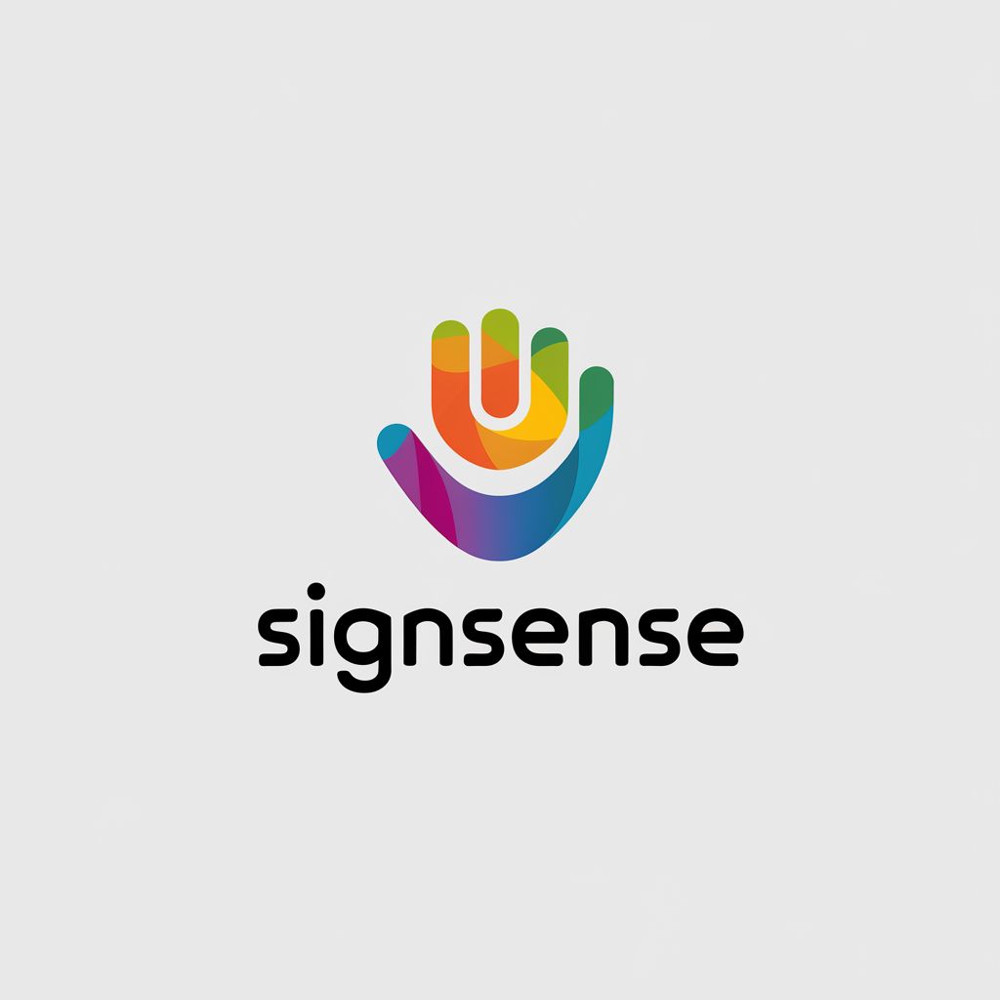
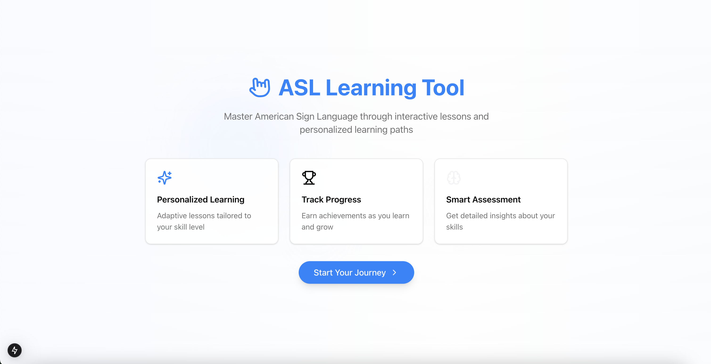

<!-- PROJECT LOGO -->
 

    

  <h1 align="center">SignSense</h1>

  

    The IoT solution to learning ASL
     
    <a href="https://devpost.com/software/sign-sense"><strong>Devpost »</strong></a>
     
     
    <a href="https://www.linkedin.com/in/anishsusarla/">Anish Susarla</a>
    ·
    <a href="https://www.linkedin.com/in/vincentcampanaro/">Vincent Campanaro</a>
    ·
    <a href="https://www.linkedin.com/in/sarthakdayal/">Sarthak Dayal</a>
  

<!-- TABLE OF CONTENTS -->

  
Table of Contents

  <ol>
    <li>
      <a href="#about-the-project">About The Project</a>
      <ul>
        <li><a href="#built-with">Built With</a></li>
      </ul>
    </li>
    <li>
      <a href="#technologies">Core Technologies</a>
      <ul>
        <li><a href="#roboflow">Mediapipe</a></li>
        <li><a href="#streamlit">Three.js</a></li>
        <li><a href="#matlab">Arduino</a></li>
        <li><a href="#optimizations">Next.js</a></li>
      </ul>
    </li>
    <li><a href="#acknowledgments">Acknowledgments</a></li>
  </ol>

<!-- ABOUT THE PROJECT -->
## About The Project

Imagine a world where learning ASL is as intuitive and enjoyable as playing your favorite video game. No more struggling through ASL coureses only to find out that it's not personalized to your learning needs, goals, and experiences; trying to find a natural signer who can give you feedback on your ASL, or (totally not one of our team members) try and train your own computer vision model to help you self train.

The reality is, ASL learning has often been a complicated task - not customizable, not intuitive, and frankly, not fun. But that's about to change.

Introducing SignSense: the first IoT device that makes ASL learning personalized, interactive, and enjoyable.

## Our Solution

SignSense introduces an innovative IoT-powered ASL learning system that combines advanced computer vision, customized learning pathways, and interactive haptic feedback. Here's what it offers:

- **Personalized Learning Experience:** After a brief survey asking users about their ASL experience and goals, custom learning pathways are generated, and are composed of lessons and sublessons, each containing specific tasks. For example, a lesson on the ASL alphabet includes sublessons for individual letters, featuring informative animations and practical exercises.

- **Real-time Gesture Recognition:** During practice sessions, our computer vision model analyzes users' hand positions through their device's camera, providing instant feedback on sign accuracy.

- **Interactive Haptic Feedback:** Users wear a smart glove that lights up specific fingers demonstrating what part of the sign/sign movement they made incorrect, offering tactile guidance for proper sign formation.

- **Adaptive Learning Loop:** If a user struggles with a sign, a custom animation demonstrates the correct transition from their attempt to the proper form. Users progress to the next sublesson only after mastering the current one.

- **Gamified Achievement System:** Upon completing their learning pathway, users earn a personalized digital trophy, encouraging continued engagement with our extensive lesson database.

This comprehensive system creates an immersive, adaptive, and rewarding ASL learning experience, making sign language acquisition more accessible and enjoyable for users of all levels.

### Built With

[![OpenCV][OpenCV]][OpenCV-url]
[![Mediapipe][Mediapipe]][Mediapipe-url]
[![Python][Python]][Python-url]
[![Nextjs][Nextjs]][Nextjs-url]
[![Databricks][Databricks]][Databricks-url]
[![MongoDB][MongoDB]][MongoDB-url]
[![GoDaddy][GoDaddy]][GoDaddy-url]
[![Arduino][Arduino]][Arduino-url]
[![Git][Git]][Git-url]
[![OpenAI API][OpenAI API]][OpenAI-url]
[![MediaPipe][MediaPipe]][MediaPipe-url]
[![Three.js][Three.js]][Three.js-url]
[![MQTT][MQTT]][MQTT-url]

<!-- MARKDOWN LINKS & IMAGES -->
<!-- https://www.markdownguide.org/basic-syntax/#reference-style-links -->
[OpenCV]: https://img.shields.io/badge/opencv-5C3EE8?style=for-the-badge&logo=opencv&logoColor=white
[OpenCV-url]: https://opencv.org/
[Mediapipe]: https://img.shields.io/badge/mediapipe-0097A7?style=for-the-badge&logo=mediapipe&logoColor=white
[Mediapipe-url]: https://github.com/google-ai-edge/mediapipe
[Python]: https://img.shields.io/badge/Python-3776AB?style=for-the-badge&logo=python&logoColor=white
[Python-url]: https://www.python.org/
[Nextjs]: https://img.shields.io/badge/Nextjs-000000?style=for-the-badge&logo=Next.js&logoColor=white
[Nextjs-url]: https://nextjs.org/
[Databricks]: https://img.shields.io/badge/databricks-FF3621?style=for-the-badge&logo=Databricks&logoColor=white
[Databricks-url]: https://www.databricks.com/product/open-source
[MongoDB]: https://img.shields.io/badge/MongoDB-47A248?style=for-the-badge&logo=MongoDB&logoColor=white
[MongoDB-url]: https://www.mongodb.com/
[GoDaddy]: https://img.shields.io/badge/GoDaddy-1BDBDB?style=for-the-badge&logo=GoDaddy&logoColor=white
[GoDaddy-url]: https://www.godaddy.com/
[Arduino]: https://img.shields.io/badge/Arduino-00979D?style=for-the-badge&logo=arduino&logoColor=white
[Arduino-url]: https://www.arduino.cc/
[Git]: https://img.shields.io/badge/Git-%23F05032.svg?style=for-the-badge&logo=git&logoColor=white
[Git-url]: https://www.github.com/
[OpenAI API]: https://img.shields.io/badge/OpenAI-412991?style=for-the-badge&logo=openai&logoColor=white
[OpenAI-url]: https://www.openai.com/
[Three.js]: https://img.shields.io/badge/Three.js-000000?style=for-the-badge&logo=three.js&logoColor=white
[Three.js-url]: https://threejs.org/
[MQTT]: https://img.shields.io/badge/MQTT-660066?style=for-the-badge&logo=mqtt&logoColor=white
[MQTT-url]: https://mqtt.org/