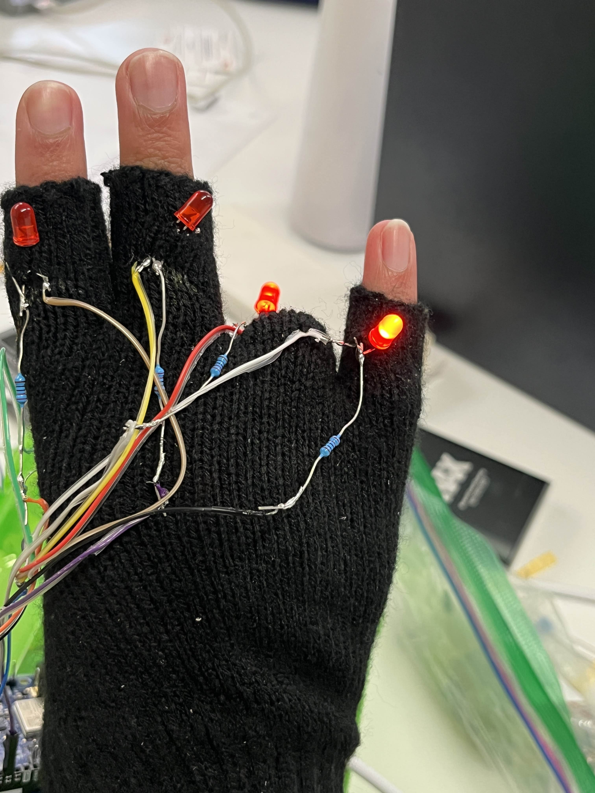

<!-- PROJECT LOGO -->
 

    

  <h1 align="center">SignSense</h1>

  

    The IoT solution to learning ASL
     
    <a href="https://devpost.com/software/sign-sense"><strong>Devpost »</strong></a>
     
     
    <a href="https://www.linkedin.com/in/anishsusarla/">Anish Susarla</a>
    ·
    <a href="https://www.linkedin.com/in/vincentcampanaro/">Vincent Campanaro</a>
    ·
    <a href="https://www.linkedin.com/in/sarthakdayal/">Sarthak Dayal</a>
  

<!-- TABLE OF CONTENTS -->

  
Table of Contents

  <ol>
    <li>
      <a href="#about-the-project">About The Project</a>
      <ul>
        <li><a href="#built-with">Built With</a></li>
      </ul>
    </li>
    <li>
      <a href="#technologies">Core Technologies</a>
      <ul>
        <li><a href="#roboflow">Mediapipe</a></li>
        <li><a href="#streamlit">Three.js</a></li>
        <li><a href="#matlab">Arduino</a></li>
        <li><a href="#optimizations">Next.js</a></li>
      </ul>
    </li>
    <li><a href="#acknowledgments">Acknowledgments</a></li>
  </ol>

  

<!-- ABOUT THE PROJECT -->
# About The Project

Imagine a world where learning ASL is as intuitive and enjoyable as playing your favorite video game. No more struggling through ASL coureses only to find out that it's not personalized to your learning needs, goals, and experiences; trying to find a natural signer who can give you feedback on your ASL, or (totally not one of our team members) try and train your own computer vision model to help you self train.

The reality is, ASL learning has often been a complicated task - not customizable, not intuitive, and frankly, not fun. But that's about to change.

Introducing SignSense: the first IoT device that makes ASL learning personalized, interactive, and enjoyable.

## Our Solution

SignSense introduces an innovative IoT-powered ASL learning system that combines advanced computer vision, customized learning pathways, and interactive haptic feedback. Here's what it offers:

- **Personalized Learning Experience:** After a brief survey asking users about their ASL experience and goals, custom learning pathways are generated, and are composed of lessons and sublessons, each containing specific tasks. For example, a lesson on the ASL alphabet includes sublessons for individual letters, featuring informative animations and practical exercises.

- **Real-time Gesture Recognition:** During practice sessions, our computer vision model analyzes users' hand positions through their device's camera, providing instant feedback on sign accuracy.

- **Interactive Haptic Feedback:** Users wear a smart glove that lights up specific fingers demonstrating what part of the sign/sign movement they made incorrect, offering tactile guidance for proper sign formation.

- **Adaptive Learning Loop:** If a user struggles with a sign, a custom animation demonstrates the correct transition from their attempt to the proper form. Users progress to the next sublesson only after mastering the current one.

- **Gamified Achievement System:** Upon completing their learning pathway, users earn a personalized digital trophy, encouraging continued engagement with our extensive lesson database.

This comprehensive system creates an immersive, adaptive, and rewarding ASL learning experience, making sign language acquisition more accessible and enjoyable for users of all levels.

## Built With

[![OpenCV][OpenCV]][OpenCV-url]
[![Mediapipe][Mediapipe]][Mediapipe-url]
[![Python][Python]][Python-url]
[![Nextjs][Nextjs]][Nextjs-url]
[![MongoDB][MongoDB]][MongoDB-url]
[![GoDaddy][GoDaddy]][GoDaddy-url]
[![Arduino][Arduino]][Arduino-url]
[![Git][Git]][Git-url]
[![OpenAI API][OpenAI API]][OpenAI-url]
[![Three.js][Three.js]][Three.js-url]
[![MQTT][MQTT]][MQTT-url]

 

# Technologies

## Computer Vision and Gesture Recognition

Our solution leverages OpenCV and MediaPipe for real-time hand gesture recognition and sign language interpretation, ensuring high accuracy and efficiency in ASL learning.

### Hand Tracking and Gesture Recognition

Using MediaPipe's hand tracking module, we accurately identify and interpret user hand gestures, precisely tracking finger positions and movements. This allows for:

- **Accurate Sign Detection:** The system can recognize and evaluate complex ASL signs, even in varying lighting conditions or backgrounds.
- **Real-time Feedback:** Users receive instant feedback on their sign accuracy, allowing for immediate corrections and improvements.

### Custom ASL Model Integration

We've integrated custom-trained machine learning models specifically for ASL recognition, on two different levels:

- **MediaPipe for static phrases:** For static words/phrases like the alphabet and numbers, MediaPipe and their hand landmarks detection model is sufficient to classify the image as a certain number/letter.
- **LSTM for Complex Phrases:** For more complicated ASL phrases, we employ a Long Short-Term Memory (LSTM) neural network. This advanced model excels at capturing the temporal dependencies in sign language, allowing for accurate interpretation of complete sentences and complex expressions.

### Adaptive Difficulty Scaling

The computer vision system adapts to the user's skill level:

- **Beginner-Friendly:** For new learners, the system focuses on specific landmarks that are correlated with getting the basic structure of the sign correct.
- **Advanced Recognition:** As users progress, the system evaluates more nuanced aspects of signing, slowly building up to integrating all 20 landmarks of the MediaPipe model.

## Hardware Pipeline

Our hardware pipeline creates a seamless interaction between the user's hand gestures and tactile feedback, utilizing computer vision, wireless communication, and a smart glove for an immersive ASL learning experience.

### Gesture Recognition and Keypoint Mapping

1. **Computer Vision Analysis:** When the user wears the glove and performs an ASL sign, our computer vision system, powered by OpenCV and MediaPipe, captures and analyzes the hand gesture.
2. **Keypoint Extraction:** The system identifies and maps 21 key points on the hand, corresponding to joints and fingertips.
3. **Gesture Classification:** These keypoints are then compared to our database of correct ASL signs to determine accuracy.

### MQTT Communication

We use MQTT (Message Queuing Telemetry Transport) for efficient, real-time communication between our gesture recognition system and the smart glove:

- The gesture recognition results are published to a specific MQTT topic.
- Our wireless Arduino board, integrated into the glove, is subscribed to this topic and receives the data instantly.

### Smart Glove Feedback

The Arduino-powered smart glove provides immediate, tactile feedback based on the gesture analysis:

- **LED Feedback:** Each finger of the glove is equipped with LEDs. If a finger is in the incorrect position for the intended sign, its corresponding LED lights up red.
- **Custom Animations:** This LED feedback will also be in the form of a custom animation on our web application.

### Feedback Loop

1. User performs an ASL sign wearing the smart glove.
2. Computer vision system captures and analyzes the hand gesture.
3. Keypoints are extracted and compared to the correct sign.
4. Results are sent via MQTT to the Arduino in the glove.
5. The Arduino activates specific LEDs based on the received data.
6. User receives instant visual and tactile feedback, with incorrect finger positions highlighted in red on the glove.

This precise, finger-specific feedback system allows users to immediately understand which aspects of their sign need adjustment, creating a highly interactive and effective learning environment for ASL.

<!-- MARKDOWN LINKS & IMAGES -->
<!-- https://www.markdownguide.org/basic-syntax/#reference-style-links -->
[OpenCV]: https://img.shields.io/badge/opencv-5C3EE8?style=for-the-badge&logo=opencv&logoColor=white
[OpenCV-url]: https://opencv.org/
[Mediapipe]: https://img.shields.io/badge/mediapipe-0097A7?style=for-the-badge&logo=mediapipe&logoColor=white
[Mediapipe-url]: https://github.com/google-ai-edge/mediapipe
[Python]: https://img.shields.io/badge/Python-3776AB?style=for-the-badge&logo=python&logoColor=white
[Python-url]: https://www.python.org/
[Nextjs]: https://img.shields.io/badge/Nextjs-000000?style=for-the-badge&logo=Next.js&logoColor=white
[Nextjs-url]: https://nextjs.org/
[MongoDB]: https://img.shields.io/badge/MongoDB-47A248?style=for-the-badge&logo=MongoDB&logoColor=white
[MongoDB-url]: https://www.mongodb.com/
[GoDaddy]: https://img.shields.io/badge/GoDaddy-1BDBDB?style=for-the-badge&logo=GoDaddy&logoColor=white
[GoDaddy-url]: https://www.godaddy.com/
[Arduino]: https://img.shields.io/badge/Arduino-00979D?style=for-the-badge&logo=arduino&logoColor=white
[Arduino-url]: https://www.arduino.cc/
[Git]: https://img.shields.io/badge/Git-%23F05032.svg?style=for-the-badge&logo=git&logoColor=white
[Git-url]: https://www.github.com/
[OpenAI API]: https://img.shields.io/badge/OpenAI-412991?style=for-the-badge&logo=openai&logoColor=white
[OpenAI-url]: https://www.openai.com/
[Three.js]: https://img.shields.io/badge/Three.js-000000?style=for-the-badge&logo=three.js&logoColor=white
[Three.js-url]: https://threejs.org/
[MQTT]: https://img.shields.io/badge/MQTT-660066?style=for-the-badge&logo=mqtt&logoColor=white
[MQTT-url]: https://mqtt.org/
